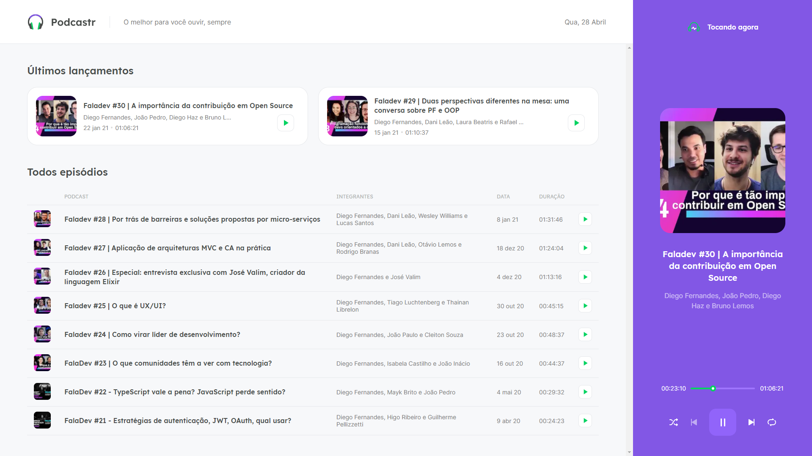

<p align="center">
    
</p>

<p align="center">
  <a href="#-projeto">Projeto</a>&nbsp;&nbsp;&nbsp;|&nbsp;&nbsp;&nbsp;
  <a href="#-ferramentas">Ferramentas</a>&nbsp;&nbsp;&nbsp;|&nbsp;&nbsp;&nbsp;
  <a href="#-tecnologias">Tecnologias</a>&nbsp;&nbsp;&nbsp;|&nbsp;&nbsp;&nbsp;
  <a href="#-rodando">Rodando</a>&nbsp;&nbsp;&nbsp;|&nbsp;&nbsp;&nbsp;
  <a href="#-layout">Layout</a>&nbsp;&nbsp;&nbsp;|&nbsp;&nbsp;&nbsp;
  <a href="#-licença">Licença</a>
</p>

<br/>

<p align="center">
    
</p>

<br/>

## 💻 PROJETO

O Podcastr é uma aplicação para reprodução de episódios em áudio do seu podcast favorito. Lista os dois episódios mais recentes em evidência e você pode avançar, retroceder, pausar e ouvir em modo aleatório.

<br/><br/>

## 🛠 FERRAMENTAS

Durante o desenvolvimento deste projeto foi utilizado os seguintes softwares:

- Ambiente de programação: [VSCode](https://code.visualstudio.com/)
- Navegador WEB: [Chrome](https://www.google.com/intl/pt-BR/chrome/) ou [Edge](https://www.microsoft.com/pt-br/edge)


<br/><br/>

## 🚀 TECNOLOGIAS

Esse projeto foi desenvolvido com as seguintes tecnologias:

- HTML
- CSS
- [React](https://reactjs.org)
- [Next.js](https://nextjs.org/)
- [TypeScript](https://www.typescriptlang.org/)


<br/><br/>

## 🧭 RODANDO

```bash

# Clone este repositório
$ git clone https://github.com/f1989/podcastr

# Acesse a pasta do projeto no VSCode
$ cd podcastr

# Instale as dependências
$ yarn 

# Abra o Terminal e execute a aplicação
$ yarn dev

# Abra outro Terminal e executeo servidor (deixando o Terminal anterior aberto e rodando junto)
$ yarn server

# Abra o navegador e acesse http://localhost:3000 ou http://127.0.0.1:3000/
```

<br/><br/>

## 🔖 LAYOUT

Você pode visualizar o layout do projeto através [desse link](https://www.figma.com/file/UwFEntsHpHYJlHNQAQr4gA/Podcastr/duplicate). É necessário ter conta no [Figma](http://figma.com/) para acessá-lo.

<br/><br/>

## 📝 LICENÇA

Esse projeto está sob a licença MIT. Veja o arquivo [LICENSE](LICENSE.md) para mais detalhes.

<br/>

---

<p align="justify">
    Feito por Fernando Oliveira Lopes durante a Quinta Edição da NLW - Next Level Week da Rocketseat, que ocorreu de 19/04/2021 à 23/04/2021.
</p>

Visite: 
<br/>
[Rocketseat](https://rocketseat.com.br/)
<br/>
[NLW - Next Level Week](https://nextlevelweek.com/)